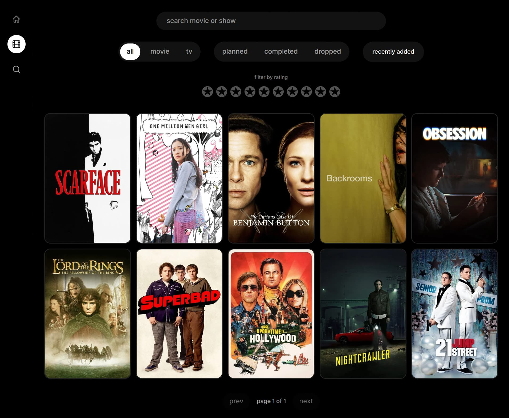
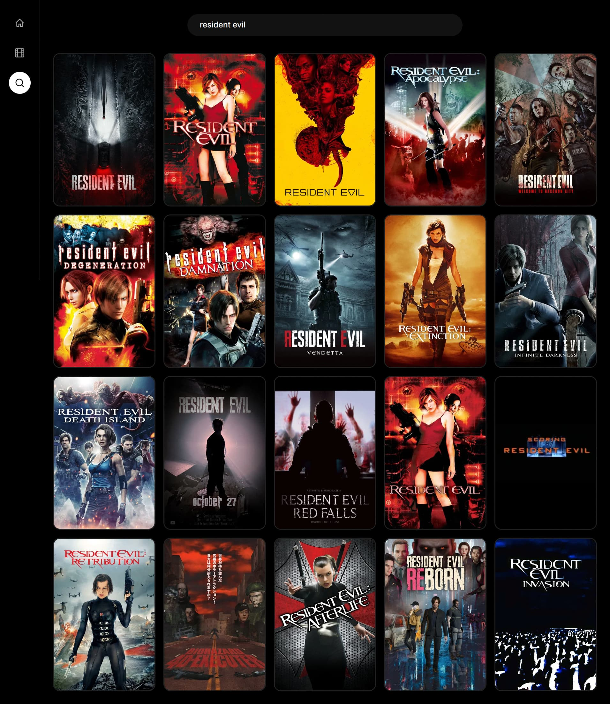

# AfterHours

<p align="center">
  
</p>
<p align="center">
  
</p>

align="center" also keeps them from looking left-jammed against the README edge. Adjust 700 to taste — most portfolio READMEs sit around 600–800px for a screenshot.

2. Actually resize the source files too

Capping display width with HTML doesn't shrink the actual file — someone's still downloading a 4K PNG that just displays smaller. Worth resizing for real, same as the earlier compression step:

bash
magick library.png -resize 900x -strip screenshots/library.jpg
magick search_add.png -resize 900x -strip screenshots/search_add.jpg

Resize to somewhat more than your display width (900px source vs 700px display) so it still looks sharp on high-DPI screens, but isn't multiple MB.

Want me to update the README with the capped-width version now?

## what is it?

AfterHours is my personal media tracker, but as a website (Blazor) — a
follow-up to my [MediaArchive.Console](https://github.com/pregoadisaputro/MediaArchive.Console)
project, now just for Movies and TV.

im making this to actually practice backend stuff properly, EF Core,
vertical-slice architecture, and consuming a API (TMDB)
instead of just reading/writing JSON like my last project lol.

## what you can do?

### library

- see all the media you've saved, movies and tv together
- search your library by title
- filter by type (movie/tv), status (planned/completed/dropped), or rating
- sort by recently added, recently updated, or id
- click into a title to see full details

### search

- search TMDB directly for a movie or show to add
- pulls title, overview, poster, backdrop, release date straight from TMDB

### tracking

- rate anything you've saved, from 0 to 10
- update its status: planned, completed, dropped
- remove it from your library whenever

## how it's built

- .NET 10 Blazor Server (interactive render mode, one project, no separate API)
- vertical-slice service layer (`IMediaService`) instead of controllers
- EF Core + SQLite for storage
- TMDB API for movie/tv metadata
- Tailwind CSS for styling

## if you want to use it

- install .NET 10 https://dotnet.microsoft.com/en-us/download
- install Node.js (needed for the Tailwind CLI build)
- clone this project
- restore npm packages:
  ```
  npm install
  ```
- get a free TMDB API read access Token (v4 auth):
  https://www.themoviedb.org/settings/api
- set it as a user secret:
  ```
  dotnet user-secrets set "Tmdb:ApiKey" "your-read-access-token-here"
  ```
- build the Tailwind CSS (in a separate terminal, keep it watching):
  ```
  npx @tailwindcss/cli -i Components/Styles/input.css -o wwwroot/app.css --watch
  ```
- run the app:
  ```
  dotnet watch run
  ```
